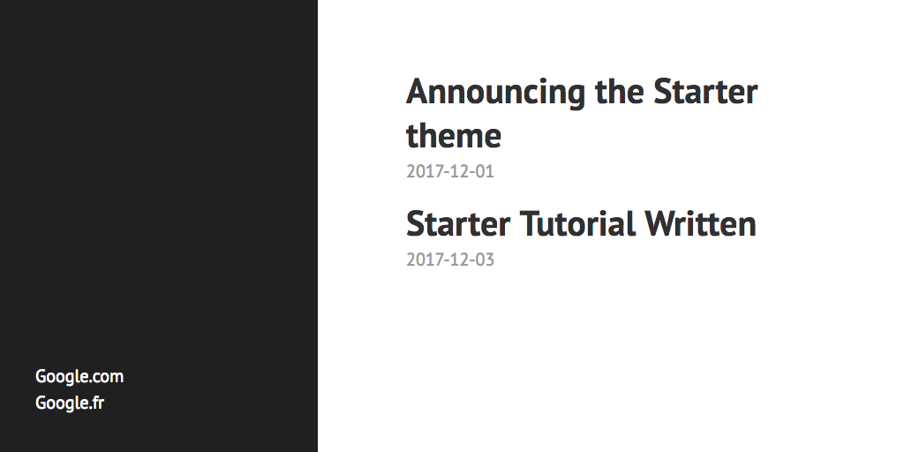

[Gutenberg static site generator tutorial](https://tomcam.github.io/g.github.io/tutorial) 

[Build a theme from scratch, step 1](https://tomcam.github.io/g.github.io/theme-tutorial-01) 

[Build a theme from scratch, step 2](https://tomcam.github.io/g.github.io/theme-tutorial-02)

<!-- 
https://tomcam.github.io/g.github.io/theme-tutorial-02
-->
<!-- 
012345678901234567890123456789012345678901234567890123456789
-->

# Gutenberg Tutorial: Using the Gutenberg static website generator

[Gutenberg](https://getgutenberg.io) lets you create high-performance websites quickly. 
It converts text files using a simple formatting language known as Markdown or [CommonMark](http://commonmark.org/) 
into HTML files via the command line. The finished site is pure HTML and therefore it is likely to be much faster
than similar websites created using WordPress.

This tutorial shows you how to:

1. Use Gutenberg from the command line to generate a minimal site on your local machine
2. Obtain a theme from the Web so you don't have to create a style sheet from scratch
3. Run Gutenberg as a local web server so you can see the site as well as your users

You will iterate through steps 2 and 3 many times in the course of the tutorial. When you edit the Markdown files used
for your website's content pages, Gutenberg detects the changes, generates the HTML files from Markdown files, and deploys them
to the site's HTML continuously. This combines the best feature of an interactive site editor (quick
and responsive) with the joys of working with text (less distracting, can be done with light system resource
usage, and doesn't lock you in to any vendor's software).

## When to use Gutenberg and when not to

Gutenberg specializes in the creation of static sites. It is not really meant to be used for data-driven sites.

### When to use Gutenberg

Gutenberg excels at creating small to medium sites with some or all of these characteristics

* Brochure sites
* Academic sites
* Blogs
* News sites (simple or divided into sections)
* Personal sites

### When to avoid Gutenberg

* Gutenberg doesn't work like WordPress, which stores its articles in a database, then renders and formats them
each time they are viewed. This data-driven approach means that interactive features like
discussion threads aren't practical with Gutenberg. Of course, there's nothing wrong with making those pages using a server side language such as PHP or Python and doing the rest of the site in Gutenberg.
* If you need WordPress plugins, don't use Gutenberg

## Pros and cons of using Gutenberg to generate your static website

Here are reasons both for and against using Gutenberg.

### Gutenberg Pros

* The websites Gutenberg creates are normally small and very fast
* Because the text format you use to create articles and posts using Gutenberg is based on Markdown, it's 
very easy to read them. There's none of the angle bracket madness you'll see in HTML. The source code for pages and articles is just Markdown and a little extra configuration in the header.
This lets you concentrate on writing articles instead of counting angle brackets or HTML tags and attributes.
* Once you know how to use the toolchain, Gutenberg lets you generate sites quickly
* Gutenberg is fantastic if you want a great-looking site that's also easy to maintain (once you know how it works)
* You can automate the creation and maintenance of websites
* Gutenberg is all in a single executable file, so installation is fuss-free
* Has [Sass](http://sass-lang.com/guide) built in (no external programs are required) so
maintaining style sheets is easier, especially on big projects
* It's free, even for commercial use, and [the source code to Gutenberg is available on Github](https://github.com/Keats/gutenberg)
* Excellent [community](https://github.com/Keats/gutenberg/issues). Gutenberg's creator, [Vincent Prouillet](https://github.com/Keats), is responsive and tolerates
dumb questions with patience

### Gutenberg Cons

* It's a command-line utility. You pretty much have to be a programmer/devops person to 
use Gutenberg. Downloading a single file and copying it to a directory
is arguably a little harder than harder than downloading, then clicking an installer

## What you should know before running this tutorial

This tutorial assumes you know:

* HTML and CSS basics
* How to use a plain text editor
* How to start and stop the terminal program for your operating system 
* How to perform simple command-line operations such as copying and deleting files
* How the path specification for executable files works in your operating system

## What you don't need to know before running this tutorial

You don't need to know about using competing products such as WordPress, Jekyll, or Hugo. From time to time they'll come up as points of reference but nothing require their prior use. You don't need to be an HTML or CSS expert.
 
## How this tutorial works

This tutorial takes you almost keystroke-by-keystroke through everything you need to create a functioning
corporate website with a home page, an About page, different sections, and a blog. You will be shown how to:

* Download Gutenberg and copy it to a directory on the path
* Use it to generate a stub website
* Copy a theme to make styling your website easier
* Edit the text files necessary to create the site

## Download Gutenberg

The first thing to do is obtain the Gutenberg static site generator binary. It is small and fast, and because it's a command-line utility written in Rust, Gutenberg works on all operating systems that Rust supports.

Gutenberg is available in many package managers but we can simply download the binary manually from the site in our case for Mac OS, Windows or Linux.

* Browse to www.getgutenberg.io,  click `GET STARTED` and follow the download instructions.

This places the Gutenberg executable in your download directory.

* Copy the executable to a location on the path. For example, on Macs and many Linux variations the following would work:

```sh
# Copy from the OS X Downloads directory to a location 
# on the path.
# In many operating systems, ~ means the user's 
# home directory, sort of like My Documents on Windows.
# sudo means run from an elevated adminstrator level.
# It is not always necessary and depends 
# on the operating system.
$ sudo cp ~/Downloads/gutenberg /usr/local/bin/
```

The site will be deployed from a directory of your choice. For various reasons
I like it to come from a subdirectory on my machine using a convention similar
to some web hosts, which often treat a site name something like `www` as the
first place on the path they look to server web pages from.

```sh 
# Create a site source code directory.
# It can be named anything, but often web
# servers deploy from a directory with a name 
# similar to this one.
# This only needs to be done once.
# So the site source code will end up in 
# directories named like this:
# ~/www/mycharity ~/www/myhomepage ~/www/mysoccerteam
$ mkdir ~/www 
```

* Now change to the directory you just created:

```sh
#  Go where all your site source code will be.
$ cd ~/www
```

## Run `gutenberg init` to create a basic site

* From this starting directory you'll run `gutenberg init`, which will
generate a simple site:

```sh
# Replace mywebsite with the root name of your site, 
# like bobsrestaurant or whatever.
$ gutenberg init mywebsite
```

You are asked a short series of configuration questions. They will be used to generate a human-readable file
named  `config.toml`. For this quick demo the answers don't matter
much but here's what they mean. Keep in mind too that it's easy to go back and edit these values in `config.toml`
directly should you change your mind about anything.

### Configuration questions for `config.toml`: site URL

First, you're asked what the site's web address (URL) will be. This will be important when
relative paths to resources in the webbsite are compiled.

```
Welcome to Gutenberg!

> What is the URL of your site? (https://example.com):
```

For now, it doesn't matter much. For this example feel free to answer with the local website address preferred by Gutenberg,
which is `http://127.0.0.1:1111`. The great thing about `config.toml` is that when you deploy to `yourawesomewebsite.com`, changing this value will be all you need to get those relative paths working properly.
 
```
> What is the URL of your site? (https://example.com): http://127.0.0.1:1111
```

For example, in Gutenberg templates you'll see constructions like this embedded in the template's HTML:

```html
<link rel="stylesheet" href="{{ get_url(path="hyde.css") }}">
```

As you can imagine `get_url()` resolves to your site's URL using the value in `config.toml` that you just set.

### Configuration questions for `config.toml`: Whether to use Sass

The next question is about Sass. Sass is a front end to CSS. You create a style sheet called,
for example, `styles.scss`, and it will run a translation step, then generate a `styles.css` file. 
This allows you to create much more readable, easy-to-maintain style sheets. For example: 

```css
$font-body-text: Roboto, Helvetica, sans-serif;

body {
  font: 100% $font-body-text;
}

.card-interior {
  font: 80% $font-body-text;
}
```

Most environments require you to download Sass separately, but one of the niftiest features of Gutenberg is that it does all this internally by leveraging the libsass C++ library without requiring that you install Sass itself.

Note that the possible answers are in mixed case, in this case `Y` and `n`. This means that presing Enter is the same as 
selecting whatever the uppercase option was.

* Press Enter to notify Gutenberg that when found, `.scss` files should be compiled to CSS.

```txt
# The capitalized choice (Y in this case) is the default.
# You can just press Enter to accept it.
> Do you want to enable Sass compilation? [Y/n]:
```

### Configuration questions for `config.toml`: use syntax highlighting


Last, you're asked if you want to enable syntax highlighting. This means that should your blog markup contain code,
it will be displayed with keywords, identifiers, comments, and so on displayed using different colors. The color
schemes themselves are configurable.

* Press the `y` key if you plan for this blog to include code.

```txt
# Press Enter if you want to accept the default N
> Do you want to enable syntax highlighting? [y/N]: y
```

Gutenberg then generates your site, warning you that it will
look minimalistic because there's no theme, and showing you
how to run the server:

```txt
Done! Your site was created in "/Users/tom/www/mywebsite"

Get started by using the built-in server: gutenberg serve
There is no built-in theme so you will see a white page.
Visit https://github.com/Keats/gutenberg for 
the full documentation.
```

Let's explore what you've just created.

## What's in your new Gutenberg directory

* If you get a directory listing for new site, you'll find that Gutenberg just did very little for you--a theme is necessary for it to display anything but nonempty HTML files. One hasn't been specified yet.

```sh
$ ls -l mywebsite
```
```txt
-rw-r--r--  1 tom  staff  372 Dec 29 01:11 config.toml
drwxr-xr-x  2 tom  staff   64 Dec 29 01:11 content
drwxr-xr-x  2 tom  staff   64 Dec 29 01:11 sass
drwxr-xr-x  2 tom  staff   64 Dec 29 01:11 static
drwxr-xr-x  2 tom  staff   64 Dec 29 01:11 templates
drwxr-xr-x  2 tom  staff   64 Dec 29 01:11 themes
```

### `/content` directory

The empty `/content` directory is where your articles will go. They are written in Markdown, a simplified format that needs to be combined with HTML templates for visual presentation.

### `/templates` directory

The empty `/templates` directory is where templates like `page.html` and `index.html` will be merged with the content articles
to yield formatted content. The appearance can be vastly different depending on how themes are created.

### `/static` directory

Assets like logo files, CSS icons, fonts, and so forth usually go in the `static` directory.

### `/sass` directory

The `.scss` files used by Sass to generate CSS files go here.

### `/config.toml` file
 
 The file `config.toml` has many options, only a few of which are included in this auto-generated file.
 You can see they contained the answers to questions you were asked after running `gutenberg init`:
 
 ```
 # The URL the site will be built for
base_url = "http://127.0.0.1:1111"

# Whether to automatically compile all Sass files in the 
# sass directory
compile_sass = true

# Whether to do syntax highlighting
# Theme can be customised by setting the `highlight_theme` 
# variable to a theme supported by Gutenberg
highlight_code = true

```

## Install a Gutenberg theme

Before you see what the site looks like, install or create a theme. Let's download the best-known one.

* Go to the themes directory for your site:

```sh
$ cd ~/www/mywebsite/themes
```

* Obtain the Hyde theme from Github.

```sh
$ git clone https://github.com/Keats/hyde.git
```

This creates a directory named `hyde` (for this example, at `~/www/mywebsite/themes/hyde`) 
populated by other directories and files that make up that theme. 

After a pause you see the following:

```txt
Cloning into 'hyde'...
remote: Counting objects: 32, done.
remote: Total 32 (delta 0), reused 0 (delta 0), pack-reused 32
Unpacking objects: 100% (32/32), done.
```

* Now take a look at the `hyde` directory:

```sh
$ ls hyde
themes/hyde/
LICENSE		sass		static		theme.toml
README.md	screenshot.png	templates
```

If you go further and look in the generated directories, you'll see that they resemble what you saw in the
website's root directory. This time they are populated with template files such as `index.html` and `page.html`,
Sass source files, and a `screenshot.png` file showing an example home page made using the Hyde theme.

### No `/content` directory?

The main difference between the contents of this theme directory and the site's root directory is 
the lack of a `/content` directory. That's because your site is skinnable using themes. Your site can use
multiple themes. Only one is active at a time. The content is the same no matter what theme is used.
They all draw from the `/content` directory for the site's editorial material.

## Update `/config.toml` with name of current theme

Now you need to specify to Gutenberg what theme is being used (because you could put other
themes in the `/themes` directory).

* Return to the site's root directory:

```sh
cd ~/www/mywebsite
```

* Open the file `config.toml` in a text editor.

* Add this line to config.toml anywhere ABOVE the section marked `[extra]`:

```
theme = "hyde"

[extra]
# Put all your custom variables here
```

## Add a page to the `/content` directory

The site is empty right now. It needs a blog post. 

* Return to the site's `/content` directory.

```sh
cd ~/www/mywebsite/content
```

### Write the blog post using Markdown syntax

We'll write a blog post using Markdown. 
The content Gutenberg expects also requires a non-displayed header.

* Write the following article using a text editor.

* Call it `article.md` and save it in /content:

```txt
+++ 
title = "Announcing the Starter theme" 
template = "page.html" 
date = "2017-12-01" 
+++ 
# New Gutenberg theme released

A new, ultra-simplified Gutenberg theme named `Starter` 
has been added to the gallery. It's a 
minimalist theme you can build on 
for your next custom Gutenberg theme.
```
### How the header works

Gutenberg actually expects all your content to include a header in a simple key/value format before the Markdown text.
Here's the header part:
```txt
+++ 
title = "Announcing the Starter theme" 
template = "page.html" 
date = "2017-12-01" 
+++ 
```

* The file must start with the header. The header beginds with a line consisting only of ```+++``` 
* Several key/value pairs may appear; for this theme the minimal key/value pairs are `title`, `template`, and `date` are all required. (The part to the left, for example, `title`, is the key. The `=` is required after the key, and the quoted item to the right is the value.)
* The ender ends with a second line consisting only of ```+++```
* The header section isn't displayed. It's used by Gutenberg to provide formatting and other meta-information for the content that follows.
* The `title` key will appear on your browser's tab, so in this case your tab will read `Announcing the Starter theme`
* The `template` key expects a value consisting of a quoted string containing the name of a specially formatted HTML file in the `/templates` directory.
* The `date` key expects a quoted string with a date and optional time in [ISO 8601](https://www.w3.org/TR/NOTE-datetime) format. 

### Formatting dates more specifically

The ISO 8601 date standard is complex, but the important thing for you to know is that if you want content sorted by something more specific than the date, you need to include the full time in IS0 8601 format. Here are examples of valid ISO 8601 values in the header:

**Year only: YYYY**
```txt
date = "2019" 
```
**Year, month: YYYY-MM**
```txt
date = "2019-11" 
```

**Year, month, date: YYYY-MM-DD**
```txt
date = "2019-11-31" 
```

**Year, month, date hours, minutes, seconds, fraction of a second: YYYY-MM-DDThh:mm:ss+d:ff**
```txt
date = "2019-11-31T16:20:30+1:00" 
```

### Multiple pages published on the same day require full date/time representation

If you have multiple blog entries with the same date, you'll need the full date value, like this. Imagine two blog entries or news stories appearing on the same date. You'd choose which went first by adding the full date and time, and making one later. For example, here's the first story, with a publication date of December 1, 2017 at 8:00am.

```text
+++ 
title = "News story 1" 
template = "page.html" 
date = "2017-12-01T08:00:00+1:00" 
+++ 
# Story 1
Very short version of story published at 8:00am.
```

Here's the second story we want to appear further on. It has a publication date of December 1, 2017 at 8:30am.

```text
+++ 
title = "News story 2" 
template = "page.html" 
date = "2017-12-01T08:30:00+1:00" 
+++ 
# Story 2
Very short version of story published at 8:30am.
```

## Generate the site with `gutenberg build`

Now it's time to convert the site's stub .md files to HTML. Gutenberg combines HTML templates
with the markup files, and the output is pure HTML files the browser can understand.

* Return to the site's root directory:

```sh
$ cd ~/www/mywebsite
```

And run `gutenberg build` like so:

```sh
$ gutenberg build
Building site...
-> Creating 1 pages (0 orphan) and 0 sections
Done in 22ms.
```

## View the site using the `gutenberg serve` web server

Gutenberg can run as a web server, allowing you to view the site exactly as end users will see it upon publishing
to the production server.

You should open a new terminal window for this because the server runs in a loop waiting for web requests.
You'll want another terminal open so you can view files and directory contents.

* Open a new terminal window.
* Change to the project directory. In this case, you'd do something like this:

```sh
# This example assumes your Gutenberg projects
# are in a subdirectory named www
# and that the example is named mywebsite.
# Change these values as needed.
$ cd ~/www/mywebsite
```
* Run the server with `gutenberg serve`:

```sh
$ gutenberg serve
Listening for changes 
in /Users/tom/www/mywebsite/{content, static, templates, sass}
Web server is available at http://127.0.0.1:1111
```

* To view your handywork, open a browser and copy in the address `http://127.0.0.1:1111`:


### Visit the blog post

The Hyde theme automatically lists articles found in the content directory on its home page. As you can see, only
the title of the article is showing. 

* Click the blog title, and you'll see the full post rendered on a new page:


## Add a second page

To understand how the Hyde theme works, add a second article.

Name this `article2.md` and save it in /content:

```
+++ 
title = "Starter theme tutorial launched" 
template = "page.html" 
date = "2017-12-03" 
+++ 
# Gutenberg Starter theme gets full tutorial treatment

The Gutenberg theme named `Starter` was designed
for tutorial purposes, although it's perfectly capable
of being used in production. This tutorial shows how
it was built line by line.

```

Run `gutenberg build` because there's a new page on the site:

```sh
$ gutenberg build
```

```txt
Building site...
-> Creating 2 pages (0 orphan) and 0 sections
Done in 62ms.
```

Note how the message went from `Creating 1 page` to `Creating 2 pages`.

The server is still running and the home page is updated automatically:



## The Hyde theme orders pages by date and time

Note

## TODO

* In date/time explanation show with both mini stories? And/or do that whole part later where the second article gets added
* Mention that articles using page.html template need particular front matter and that filename doesn't matter
* Explain how title works


# Reference

* Gutenberg [website](https://www.getgutenberg.io/)
* Gutenberg on [Github](https://github.com/Keats/gutenberg)
* Creating a Gutenberg [theme](https://www.getgutenberg.io/documentation/themes/creating-a-theme/)
* [Learn Sass](http://sass-lang.com/guide)
* The CommonMark [Markdown standard](http://commonmark.org/), ((Quick reference))[http://commonmark.org/help/], [10 minute tutorial](http://commonmark.org/help/tutorial/)
* The [YAML](http://www.yaml.org/about.html) site isn't as informative as the explanation at the site for [Grav](https://learn.getgrav.org/advanced/yaml), a Gutenberg competitor
* [ISO 8601](https://www.w3.org/TR/NOTE-datetime) date formats are complicated


[Gutenberg static site generator tutorial](https://tomcam.github.io/g.github.io/tutorial) 

[Build a theme from scratch, step 1](https://tomcam.github.io/g.github.io/theme-tutorial-01) 

[Build a theme from scratch, step 2](https://tomcam.github.io/g.github.io/theme-tutorial-02)
<!--
[Tutorial](tutorial.md) [Theme tutorial 1](theme-tutorial-01.md) [Theme tutorial 2](theme-tutorial-02.md)
-->
